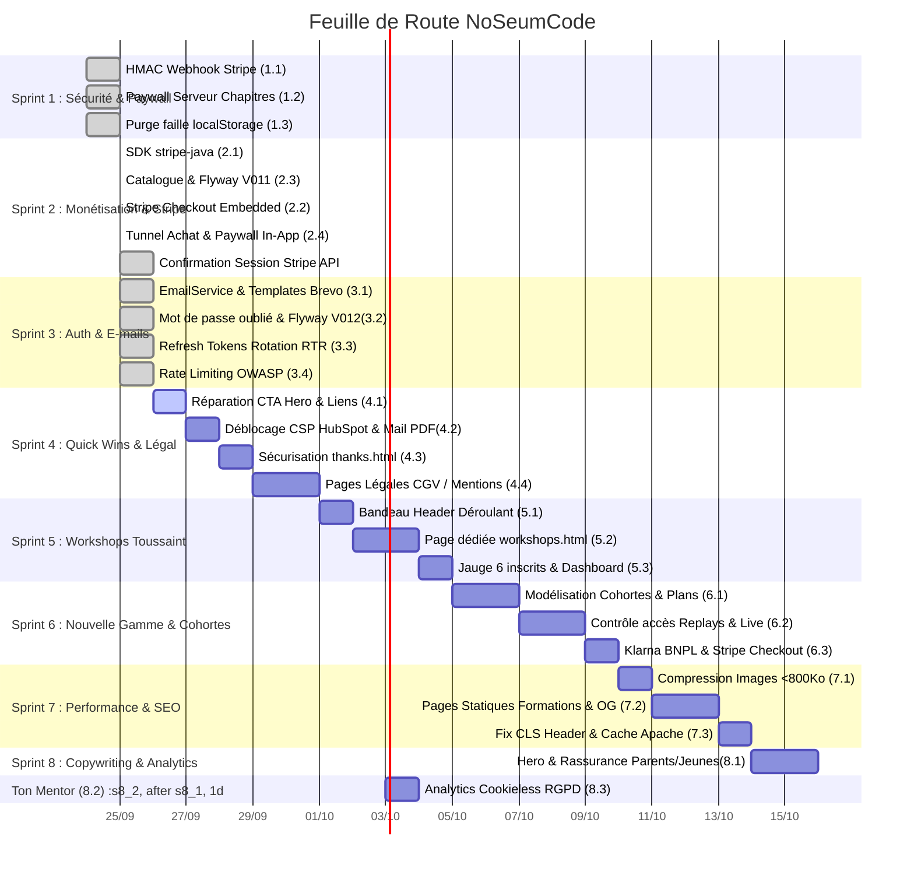

# ROADMAP.md — Feuille de Route Commerciale NoSeumCode

> _Dernière mise à jour : 2026-09-26_  
> _Objectif : Transformer le MVP NoSeumCode en produit final, sécurisé, commercialisable et prêt pour la production._

---

## 🎯 Vue d'ensemble des Sprints

| Sprint | Thème Principal | Objectif Clé | Statut |
| :--- | :--- | :--- | :--- |
| **Sprint 1** | **Sécurité & Paywall Serveur** | Bloquer l'accès gratuit aux cours et sécuriser le webhook Stripe (HMAC SHA-256) | ✅ **Terminé** |
| **Sprint 2** | **Tunnel de Vente & Monétisation** | Intégrer Stripe Embedded Checkout réel et métadonnées marchandes | ✅ **Terminé** |
| **Sprint 3** | **Auth, Comptes & E-mails** | Mot de passe oublié, emails transactionnels Brevo, sessions RTR 7 jours | ✅ **Terminé** |
| **Sprint 4** | **Quick Wins Conversion, Leads & Légal** | Réparer les CTA Hero, débloquer CSP HubSpot, sécuriser `thanks.html`, pages légales | 🟡 **En cours / Prêt** |
| **Sprint 5** | **Workshops Gratuits Toussaint** | Bandeau header réactivé, page dédiée `workshops.html`, jauge stricte 6 élèves max | ⚪ **Planifié** |
| **Sprint 6** | **Nouvelle Gamme & Accès Cohortes** | Pack Starter (accès replays à vie), Pack Web, option VIP, Klarna BNPL via Stripe | ⚪ **Planifié** |
| **Sprint 7** | **Performance Web & SEO Technique** | Compression images (<800 Ko), rendu statique dédié formations, fix CLS, cache Apache | ⚪ **Planifié** |
| **Sprint 8** | **Copywriting & Rassurance Parents/Jeunes** | Refonte Hero, section Ton Mentor, rassurance parents, Analytics RGPD cookieless | ⚪ **Planifié** |

---

## 📊 Diagramme de Gantt (Rendu Visuel GitHub & Git)

---

## 📋 Détail des Sprints

### Sprint 1 : Sécurité du Paywall Serveur & Webhook Stripe (Terminé)
- **1.1 Validation HMAC Webhook Stripe** (`PaymentController.java`) : Validation cryptographique du header `Stripe-Signature` avec tolérance anti-rejeu.
- **1.2 Paywall Serveur sur Chapitres & Contenus** (`ChapterController.java`, `ContentController.java`) : Vérification stricte des inscriptions `PAID`.
- **1.3 Purge de la faille client** (`cours.js`, `dashboard.js`) : Élimination de `noseum_payments` dans le localStorage.

---

### Sprint 2 : Monétisation Réelle & Tunnel Stripe Checkout (Terminé)
- **2.1 Intégration du SDK Stripe** : `com.stripe:stripe-java` dans `backend/pom.xml` via architecture Ports/Adapters (`StripeGateway`).
- **2.2 Endpoint Checkout Session** (`POST /api/payments/create-checkout-session`) : Session Stripe Embedded Checkout avec mode `payment`.
- **2.3 Modèle Économique & Catalogue** (`Course.java`, Flyway migration V011) : Tarifs, slugs, devises, publication.

---

### Sprint 3 : Comptes Apprenants & E-mails Transactionnels (Terminé)
- **3.1 Fournisseur Mail Transactionnel Brevo** : Intégration des templates e-mail transactionnels.
- **3.2 Flux Mot de Passe Oublié** : Endpoints `POST /api/auth/forgot-password` et `POST /api/auth/reset-password` avec hachage SHA-256 du token (Flyway V012).
- **3.3 Refresh Token Rotation (RTR)** : Persistance PostgreSQL hachée SHA-256 avec rotation automatique sur 7 jours.
- **3.4 Sécurité OWASP** : Filtre de Rate Limiting (15 req/min par IP, HTTP 429) et validation stricte des mots de passe.

---

### Sprint 4 : Quick Wins Conversion, Déblocage Leads & Légal (En cours / Prochain)
- **4.1 Réparation des CTA du Hero** (`frontend/index.html`) :
  - Bouton 1 : *"Go coder"* ➔ Redirection fluide vers `cours.html`.
  - Bouton 2 : *"Teste et kiffe !"* ➔ Redirection vers la future page des ateliers gratuits (`workshops.html` ou modale programme).
- **4.2 Déblocage CSP HubSpot & Stratégie Lead Magnet** (`frontend/.htaccess`, `popover-hubspot.js`) :
  - Autoriser `https://js-eu1.hsforms.net` et `https://forms-eu1.hsforms.com` dans `script-src`, `connect-src`, `frame-src`.
  - Configuration de l'envoi du programme de formation par e-mail automatique pour forcer des e-mails qualifiés.
- **4.3 Sécurisation de `thanks.html` et des PDFs** :
  - Ajout de `<meta name="robots" content="noindex, nofollow">` sur `thanks.html`, `dashboard.html`, `reset-password.html`.
  - Retrait des pages privées du `sitemap.xml`.
  - Correction du bouton Git & GitHub dans `thanks.html` (qui téléchargeait le PDF JavaScript par erreur).
- **4.4 Pages Légales & Conformité RGPD** :
  - Création de `mentions-legales.html`, `cgv.html`, `politique-confidentialite.html`.
  - Remplacement des liens factices du footer.
  - Retrait des boutons sociaux non implémentés (Facebook, GitHub auth) du formulaire de connexion/inscription.

---

### Sprint 5 : Workshops Gratuits Toussaint (Acquisition & Preuves Vidéos)
- **5.1 Bandeau Header Déroulant** (`frontend/partials/header.html`) :
  - Décommenter et réactiver le bandeau supérieur de promotion des ateliers découvertes gratuits.
- **5.2 Page dédiée Workshops** (`frontend/workshops.html`) :
  - Présentation des ateliers live découvertes (HTML/CSS & JavaScript) de 2h pendant les vacances.
- **5.3 Gestion de la Jauge & Inscription** :
  - Limite stricte de 6 participants maximum par session d'atelier.
  - Réservation rattachée au compte étudiant et synchronisée avec le dashboard.

---

### Sprint 6 : Nouvelle Gamme & Accès Cohortes (Starter, Web, VIP & Klarna)
- **6.1 Nettoyage Catalogue & Modèle Économique** :
  - Suppression définitive des faux cours d'essai (Java 21 à 49 € et Clean Architecture à 69 €).
  - Création de la gamme : **Pack Starter** (Découverte & Fondations - 6 semaines) et **Pack Web** (Parcours complet interactif).
  - Option **Mentorat VIP** : Pack Web + 4 sessions individuelles d'1h planifiées avec le formateur.
- **6.2 Modélisation Backend & Règle des Replays** :
  - Entité `Cohort` et type de souscription dans `Enrollment`.
  - **Les élèves Starter conservent l'accès à vie aux replays de leur tronc commun (HTML/CSS/Git)**.
  - Verrouillage automatique côté backend des sessions live et des replays des modules avancés (JavaScript, API, CI/CD) pour les élèves Starter.
- **6.3 Intégration Klarna (BNPL)** :
  - Activation de Klarna via Stripe Checkout pour le paiement fractionné en 3x/4x sans risque d'impayé (fonds garantis par Klarna).

---

### Sprint 7 : Performance Web & SEO Technique
- **7.1 Compression Drastique des Images** :
  - Remplacement du faux `git.webp` (2,73 Mo) par un vrai WebP compressé (<100 Ko).
  - Optimisation des logos PNG (`logo-css`, `logo-react`, `logo-js`) et du favicon (passage de 10 Mo au total à <800 Ko).
- **7.2 Pages Statiques Formations & Métadonnées Dynamiques** :
  - Fichiers HTML statiques dédiés pour chaque offre (`/formations/starter.html`, `/formations/pack-web.html`).
  - Balises Open Graph réelles (1200x630 px) et données structurées Schema.org `Course`.
- **7.3 Optimisation Core Web Vitals & Cache Apache** :
  - Hauteur réservée au conteneur `#header-placeholder` pour éliminer le CLS.
  - Directives de compression `mod_deflate` / Brotli et expiration de cache pour WebP/AVIF/fonts dans `.htaccess`.

---

### Sprint 8 : Refonte Copywriting & Rassurance Parents/Jeunes
- **8.1 Repositionnement du Message & Hero** :
  - Titre : *"Apprendre à coder en construisant de vrais projets"*.
  - Double discours : cool et valorisant pour les 16-25 ans, structuré et rassurant pour les parents (cours en direct, petits groupes de 6, 2h cours + 2h atelier projet par semaine).
- **8.2 Section "Ton Mentor"** :
  - Présentation de Cédric, son parcours technique, sa pédagogie active et humaine.
- **8.3 Analytics Conforme RGPD & Cookieless** :
  - Intégration de Plausible ou Umami (léger, respectueux de la vie privée, sans bandeau cookie intrusif).
  - Mesure des conversions (clics CTA, soumissions HubSpot, checkouts Stripe).
