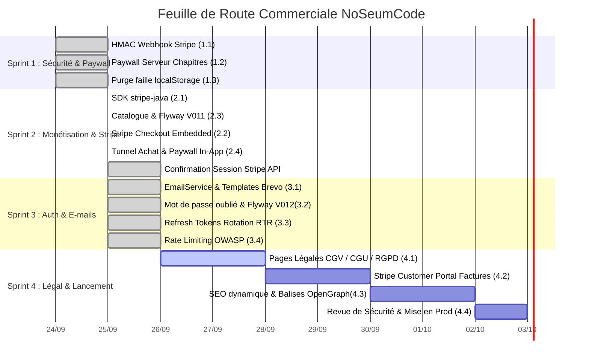

# ROADMAP.md — Feuille de Route Commerciale NoSeumCode

> _Dernière mise à jour : 2026-09-26_  
> _Objectif : Transformer le MVP NoSeumCode en produit final, sécurisé, commercialisable et prêt pour la production._

---

## 🎯 Vue d'ensemble des Sprints

| Sprint | Thème Principal | Objectif Clé | Statut |
| :--- | :--- | :--- | :--- |
| **Sprint 1** | **Sécurité & Paywall Serveur** | Bloquer l'accès gratuit aux cours et sécuriser le webhook Stripe | ✅ **Terminé** |
| **Sprint 2** | **Tunnel de Vente & Monétisation** | Intégrer Stripe Checkout réel et métadonnées marchandes | ✅ **Terminé** |
| **Sprint 3** | **Auth, Comptes & E-mails** | Mot de passe oublié, emails transactionnels, sessions stables | ✅ **Terminé** |
| **Sprint 4** | **Légal, Facturation & Lancement** | Pages légales (CGV), Portail client factures, SEO dynamique | 🟡 **Prochain** |

---

## 📊 Diagramme de Gantt (Rendu Visuel GitHub & Git)

---

## 📋 Détail des Sprints

### Sprint 1 : Sécurité du Paywall Serveur & Webhook Stripe (Priorité Absolue)
- **1.1 Validation HMAC Webhook Stripe** (`PaymentController.java`) :
  - Intégrer `STRIPE_WEBHOOK_SECRET` et valider la signature cryptographique du header `Stripe-Signature`.
- **1.2 Paywall Serveur sur Chapitres & Contenus** (`ChapterController.java`, `ContentController.java`) :
  - Vérifier que l'utilisateur connecté possède une inscription avec statut `PAID` (ou autoriser uniquement le chapitre preview gratuit).
  - Interdire l'accès direct aux leçons et vidéos aux utilisateurs non payants.
- **1.3 Purge de la faille client** (`cours.js`, `dashboard.js`) :
  - Supprimer le contournement de statut via `localStorage.getItem("noseum_payments")`.
  - Se fier uniquement aux claims JWT et à la réponse de l'API.

---

### Sprint 2 : Monétisation Réelle & Tunnel Stripe Checkout
- **2.1 Intégration du SDK Stripe** :
  - Ajouter `com.stripe:stripe-java` dans `backend/pom.xml`.
- **2.2 Endpoint Checkout Session** (`POST /api/payments/create-checkout-session`) :
  - Création de session Stripe hébergée avec redirections vers `thanks.html` et `cours.html`.
- **2.3 Modèle Économique & Catalogue** (`Course.java`, Flyway migration) :
  - Ajouter `priceInCents`, `currency`, `slug`, `thumbnailUrl`, `level`, `isPublished`.
- **2.4 Bouton d'Achat Frontend** (`cours.js`) :
  - Redirection fluide vers Stripe Checkout au clic sur "S'inscrire / Acheter".

---

### Sprint 3 : Comptes Apprenants & E-mails Transactionnels
- **3.1 Fournisseur Mail Transactionnel** :
  - Intégration Brevo, SendGrid ou SMTP pour les notifications critiques.
- **3.2 Flux Mot de Passe Oublié (Self-service)** :
  - Endpoint `POST /api/auth/forgot-password` (génération de token à usage unique envoyé par email).
  - Endpoint `POST /api/auth/reset-password` (mise à jour du mot de passe hashé en BCrypt).
- **3.3 Pérennité de Session** :
  - Mise en place d'un Refresh Token ou extension maîtrisée de la durée de session pour éviter la déconnexion après 1h.

---

### Sprint 4 : Conformité Légale, Factures & Lancement
- **4.1 Pages Légales Obligatoires (France/UE)** :
  - Création de `cgv.html`, `cgu.html`, `mentions-legales.html`, `politique-confidentialite.html`.
- **4.2 Portail Client Stripe (Factures & Abonnements)** :
  - Endpoint pour ouvrir le Stripe Customer Portal dans le dashboard apprenant.
- **4.3 Optimisation SEO & Réseaux Sociaux** :
  - URLs propres avec slugs et balises OpenGraph dynamiques par cours pour le partage.
