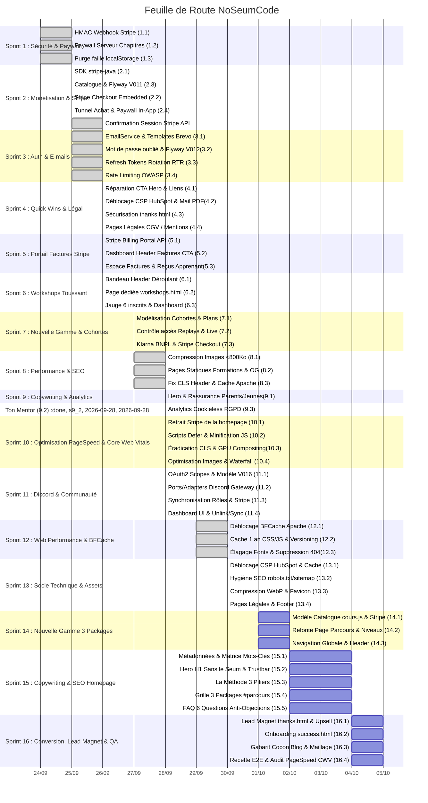

# ROADMAP.md — Feuille de Route Commerciale NoSeumCode

> _Dernière mise à jour : 2026-09-30_  
> _Objectif : Transformer le MVP NoSeumCode en produit final, sécurisé, commercialisable et prêt pour la production._

---

## 🎯 Vue d'ensemble des Sprints

| Sprint | Thème Principal | Objectif Clé | Statut |
| :--- | :--- | :--- | :--- |
| **Sprint 1** | **Sécurité & Paywall Serveur** | Bloquer l'accès gratuit aux cours et sécuriser le webhook Stripe (HMAC SHA-256) | ✅ **Terminé** |
| **Sprint 2** | **Tunnel de Vente & Monétisation** | Intégrer Stripe Embedded Checkout réel et métadonnées marchandes | ✅ **Terminé** |
| **Sprint 3** | **Auth, Comptes & E-mails** | Mot de passe oublié, emails transactionnels Brevo, sessions RTR 7 jours | ✅ **Terminé** |
| **Sprint 4** | **Quick Wins Conversion, Leads & Légal** | Réparer les CTA Hero, débloquer CSP HubSpot, sécuriser `thanks.html`, pages légales | ✅ **Terminé** |
| **Sprint 5** | **Portail Client Stripe** | Factures PDF, reçus d'achat et gestion des moyens de paiement apprenant | ✅ **Terminé** |
| **Sprint 6** | **Workshops Gratuits Toussaint** | Bandeau header réactivé, page dédiée `workshops.html`, jauge stricte 6 élèves max | ✅ **Terminé** |
| **Sprint 7** | **Nouvelle Gamme & Accès Cohortes** | Pack Starter (accès replays à vie), Pack Web, option VIP, Klarna BNPL via Stripe | ✅ **Terminé** |
| **Sprint 8** | **Performance Web & SEO Technique** | Compression images (<800 Ko), rendu statique dédié formations, fix CLS, cache Apache | ✅ **Terminé** |
| **Sprint 9** | **Copywriting & Rassurance Parents/Jeunes** | Refonte Hero, section Ton Mentor, rassurance parents, Analytics RGPD cookieless | ✅ **Terminé** |
| **Sprint 10** | **Optimisation PageSpeed & Core Web Vitals** | LCP < 1.5s, éradication CLS 0.175 sur Hero, déferrement Stripe & GPU compositing | ✅ **Terminé** |
| **Sprint 11** | **Intégration Discord & Communauté** | OAuth2 Discord (`identify`, `email`, `guilds.join`), liaison compte, auto-join guild et synchronisation dynamique des rôles selon le palier (Starter, Web, VIP) | ✅ **Terminé** |
| **Sprint 12** | **Web Performance, BFCache & Cache Policy** | Déblocage BFCache (.htaccess), cache 1 an CSS/JS, versioning assets, élagage Google Fonts (-35Ko) | ✅ **Terminé** |
| **Sprint 13** | **Socle Technique, Sécurité Serveur & Assets** | Déblocage CSP HubSpot, cache Apache étendu, SEO technique (robots.txt, sitemap), compression WebP (>5 Mo) et 3 pages légales | ✅ **Terminé** |
| **Sprint 14** | **Nouvelle Architecture des Offres (3 Packages)** | Modélisation catalogue `cours.js` (Starter 89 €, Web Pro 179 €, VIP 389 €), alignement Stripe, navigation `header.html` et page parcours | 📋 **Planifié** |
| **Sprint 15** | **Refonte Copywriting Homepage & SEO Sémantique** | Copywriting validé, H1/Hero percutant, suppression du double regard, grille des 3 offres `#parcours`, FAQ 6 questions et mots-clés cibles | 📋 **Planifié** |
| **Sprint 16** | **Tunnel Lead Magnet, Onboarding & Cocon Blog** | Sécurisation `thanks.html` (liens PDF + upsell), onboarding `success.html`, gabarit cocon blog (`article.html`) et recette globale | 📋 **Planifié** |

---

## 📊 Diagramme de Gantt (Rendu Visuel GitHub & Git)

```mermaid
gantt
    title Feuille de Route NoSeumCode
    dateFormat  YYYY-MM-DD
    axisFormat  %d/%m

    section Sprint 1 : Sécurité & Paywall
    HMAC Webhook Stripe (1.1)            :done, s1_1, 2026-09-24, 2026-09-25
    Paywall Serveur Chapitres (1.2)      :done, s1_2, 2026-09-24, 2026-09-25
    Purge faille localStorage (1.3)      :done, s1_3, 2026-09-24, 2026-09-25

    section Sprint 2 : Monétisation & Stripe
    SDK stripe-java (2.1)                :done, s2_1, 2026-09-25, 2026-09-25
    Catalogue & Flyway V011 (2.3)        :done, s2_2, 2026-09-25, 2026-09-25
    Stripe Checkout Embedded (2.2)       :done, s2_3, 2026-09-25, 2026-09-25
    Tunnel Achat & Paywall In-App (2.4)  :done, s2_4, 2026-09-25, 2026-09-25
    Confirmation Session Stripe API      :done, s2_5, 2026-09-25, 2026-09-26

    section Sprint 3 : Auth & E-mails
    EmailService & Templates Brevo (3.1) :done, s3_1, 2026-09-25, 2026-09-26
    Mot de passe oublié & Flyway V012(3.2):done, s3_2, 2026-09-25, 2026-09-26
    Refresh Tokens Rotation RTR (3.3)    :done, s3_3, 2026-09-25, 2026-09-26
    Rate Limiting OWASP (3.4)            :done, s3_4, 2026-09-25, 2026-09-26

    section Sprint 4 : Quick Wins & Légal
    Réparation CTA Hero & Liens (4.1)    :done, s4_1, 2026-09-26, 2026-09-26
    Déblocage CSP HubSpot & Mail PDF(4.2):done, s4_2, 2026-09-26, 2026-09-26
    Sécurisation thanks.html (4.3)       :done, s4_3, 2026-09-26, 2026-09-26
    Pages Légales CGV / Mentions (4.4)   :done, s4_4, 2026-09-26, 2026-09-26

    section Sprint 5 : Portail Factures Stripe
    Stripe Billing Portal API (5.1)      :done, s5_1, 2026-09-26, 2026-09-26
    Dashboard Header Factures CTA (5.2)  :done, s5_2, 2026-09-26, 2026-09-26
    Espace Factures & Reçus Apprenant(5.3):done, s5_3, 2026-09-26, 2026-09-26

    section Sprint 6 : Workshops Toussaint
    Bandeau Header Déroulant (6.1)       :done, s6_1, 2026-09-26, 2026-09-26
    Page dédiée workshops.html (6.2)     :done, s6_2, 2026-09-26, 2026-09-26
    Jauge 6 inscrits & Dashboard (6.3)   :done, s6_3, 2026-09-26, 2026-09-26

    section Sprint 7 : Nouvelle Gamme & Cohortes
    Modélisation Cohortes & Plans (7.1)  :done, s7_1, 2026-09-27, 2026-09-27
    Contrôle accès Replays & Live (7.2)  :done, s7_2, 2026-09-27, 2026-09-27
    Klarna BNPL & Stripe Checkout (7.3)  :done, s7_3, 2026-09-27, 2026-09-27

    section Sprint 8 : Performance & SEO
    Compression Images <800Ko (8.1)      :done, s8_1, 2026-09-27, 2026-09-28
    Pages Statiques Formations & OG (8.2):done, s8_2, 2026-09-27, 2026-09-28
    Fix CLS Header & Cache Apache (8.3)  :done, s8_3, 2026-09-27, 2026-09-28

    section Sprint 9 : Copywriting & Analytics
    Hero & Rassurance Parents/Jeunes(9.1):done, s9_1, 2026-09-28, 2026-09-28
    Section Ton Mentor (9.2)             :done, s9_2, 2026-09-28, 2026-09-28
    Analytics Cookieless RGPD (9.3)      :done, s9_3, 2026-09-28, 2026-09-28

    section Sprint 10 : Optimisation PageSpeed & Core Web Vitals
    Retrait Stripe de la homepage (10.1) :done, s10_1, 2026-09-28, 2026-09-28
    Scripts Defer & Minification JS (10.2):done, s10_2, 2026-09-28, 2026-09-28
    Éradication CLS & GPU Compositing(10.3):done, s10_3, 2026-09-28, 2026-09-28
    Optimisation Images & Waterfall (10.4):done, s10_4, 2026-09-28, 2026-09-28

    section Sprint 11 : Discord & Communauté
    OAuth2 Scopes & Modèle V016 (11.1)   :done, s11_1, 2026-09-28, 2026-09-28
    Ports/Adapters Discord Gateway (11.2):done, s11_2, 2026-09-28, 2026-09-28
    Synchronisation Rôles & Stripe (11.3):done, s11_3, 2026-09-28, 2026-09-28
    Dashboard UI & Unlink/Sync (11.4)    :done, s11_4, 2026-09-28, 2026-09-28

    section Sprint 12 : Web Performance & BFCache
    Déblocage BFCache Apache (12.1)      :done, s12_1, 2026-09-29, 2026-09-30
    Cache 1 an CSS/JS & Versioning (12.2):done, s12_2, 2026-09-29, 2026-09-30
    Élagage Fonts & Suppression 404(12.3):done, s12_3, 2026-09-29, 2026-09-30

    section Sprint 13 : Socle Technique & Assets
    Déblocage CSP HubSpot & Cache (13.1) :done, s13_1, 2026-09-30, 2026-09-30
    Hygiène SEO robots.txt/sitemap (13.2):done, s13_2, 2026-09-30, 2026-09-30
    Compression WebP & Favicon (13.3)    :done, s13_3, 2026-09-30, 2026-09-30
    Pages Légales & Footer (13.4)        :done, s13_4, 2026-09-30, 2026-09-30

    section Sprint 14 : Nouvelle Gamme 3 Packages
    Modèle Catalogue cours.js & Stripe (14.1):s14_1, 2026-10-01, 2026-10-02
    Refonte Page Parcours & Niveaux (14.2)   :s14_2, 2026-10-01, 2026-10-02
    Navigation Globale & Header (14.3)       :s14_3, 2026-10-01, 2026-10-02

    section Sprint 15 : Copywriting & SEO Homepage
    Métadonnées & Matrice Mots-Clés (15.1)   :s15_1, 2026-10-02, 2026-10-04
    Hero H1 Sans le Seum & Trustbar (15.2)   :s15_2, 2026-10-02, 2026-10-04
    La Méthode 3 Piliers (15.3)              :s15_3, 2026-10-02, 2026-10-04
    Grille 3 Packages #parcours (15.4)       :s15_4, 2026-10-02, 2026-10-04
    FAQ 6 Questions Anti-Objections (15.5)   :s15_5, 2026-10-02, 2026-10-04

    section Sprint 16 : Conversion, Lead Magnet & QA
    Lead Magnet thanks.html & Upsell (16.1)  :s16_1, 2026-10-04, 2026-10-05
    Onboarding success.html (16.2)           :s16_2, 2026-10-04, 2026-10-05
    Gabarit Cocon Blog & Maillage (16.3)     :s16_3, 2026-10-04, 2026-10-05
    Recette E2E & Audit PageSpeed CWV (16.4) :s16_4, 2026-10-04, 2026-10-05
```

---

## 📋 Détail des Sprints

### Sprint 1 : Sécurité du Paywall Serveur & Webhook Stripe (Terminé)
- **1.1 Validation HMAC Webhook Stripe** (`PaymentController.java`) : Validation cryptographique du header `Stripe-Signature` avec tolérance anti-rejeu.
- **1.2 Paywall Serveur sur Chapitres & Contenus** (`ChapterController.java`, `ContentController.java`) : Vérification stricte des inscriptions `PAID`.
- **1.3 Purge de la faille client** (`cours.js`, `dashboard.js`) : Élimination de `noseum_payments` dans le localStorage.

---

### Sprint 2 : Monétisation Réelle & Tunnel Stripe Checkout (Terminé)
- **2.1 Intégration du SDK Stripe** : `com.stripe:stripe-java` dans `backend/pom.xml` via architecture Ports/Adapters (`StripeGateway`).
- **2.2 Endpoint Checkout Session** (`POST /api/payments/create-checkout-session`) : Session Stripe Embedded Checkout avec mode `payment`.
- **2.3 Modèle Économique & Catalogue** (`Course.java`, Flyway migration V011) : Tarifs, slugs, devises, publication.

---

### Sprint 3 : Comptes Apprenants & E-mails Transactionnels (Terminé)
- **3.1 Fournisseur Mail Transactionnel Brevo** : Intégration des templates e-mail transactionnels.
- **3.2 Flux Mot de Passe Oublié** : Endpoints `POST /api/auth/forgot-password` et `POST /api/auth/reset-password` avec hachage SHA-256 du token (Flyway V012).
- **3.3 Refresh Token Rotation (RTR)** : Persistance PostgreSQL hachée SHA-256 avec rotation automatique sur 7 jours.
- **3.4 Sécurité OWASP** : Filtre de Rate Limiting (15 req/min par IP, HTTP 429) et validation stricte des mots de passe.

---

### Sprint 4 : Quick Wins Conversion, Déblocage Leads & Légal (Terminé)
- **4.1 Réparation des CTA du Hero** (`frontend/index.html`) :
  - Bouton 1 : *"Go coder"* ➔ Redirection fluide vers `cours.html`.
  - Bouton 2 : *"Teste et kiffe !"* ➔ Ouverture directe de la modale des sessions découvertes pour réserver sa place.
- **4.2 Déblocage CSP HubSpot & Stratégie Lead Magnet** (`frontend/.htaccess`, `popover-hubspot.js`) :
  - Autoriser `https://js-eu1.hsforms.net` et `https://forms-eu1.hsforms.com` dans `script-src`, `connect-src`, `frame-src`.
  - Configuration de l'envoi du programme de formation par e-mail automatique pour forcer des e-mails qualifiés.
- **4.3 Sécurisation de `thanks.html` et des PDFs** :
  - Ajout de `<meta name="robots" content="noindex, nofollow">` sur `thanks.html`, `dashboard.html`, `reset-password.html`.
  - Retrait des pages privées du `sitemap.xml`.
  - Correction du bouton Git & GitHub dans `thanks.html` (qui téléchargeait le PDF JavaScript par erreur).
- **4.4 Pages Légales & Conformité RGPD** :
  - Création de `mentions-legales.html`, `cgv.html`, `politique-confidentialite.html`.
  - Remplacement des liens factices du footer.
  - Retrait des boutons sociaux non implémentés (Facebook, GitHub auth) du formulaire de connexion/inscription.

---

### Sprint 5 : Portail Client Stripe (Factures & Abonnements) (Terminé)
- **5.1 API Backend Stripe Customer Portal** (`PaymentController.java`, `PaymentService.java`, `StripeGatewayImpl.java`) :
  - Endpoint sécurisé `POST /api/payments/create-customer-portal-session` protégé par JWT.
  - Résolution automatique du Customer Stripe par email (création à la volée si inexistant).
  - Génération de session `com.stripe.model.billingportal.Session` avec URL de retour vers le tableau de bord NoSeumCode.
- **5.2 Accès Rapide Header Apprenant** (`frontend/dashboard.html`) :
  - Bouton interactif « Factures » avec icône SVG dans la barre d'outils utilisateur.
- **5.3 Carte Facturation Espace Apprenant** (`frontend/dashboard.html`, `frontend/js/dashboard.js`) :
  - Section dédiée « Facturation & Abonnements » intégrée dans la vue Apprenant.
  - Bouton de redirection vers le portail officiel Stripe avec gestion du loading state et feedback en cas d'erreur.

---

### Sprint 6 : Workshops Gratuits Toussaint (Acquisition & Preuves Vidéos)
- **6.1 Bandeau Header Déroulant** (`frontend/partials/header.html`) :
  - Décommenter et réactiver le bandeau supérieur de promotion des ateliers découvertes gratuits.
- **6.2 Page dédiée Workshops** (`frontend/workshops.html`) :
  - Présentation des ateliers live découvertes (HTML/CSS & JavaScript) de 2h pendant les vacances.
- **6.3 Gestion de la Jauge & Inscription** :
  - Limite stricte de 6 participants maximum par session d'atelier.
  - Réservation rattachée au compte étudiant et synchronisée avec le dashboard.

---

### Sprint 7 : Nouvelle Gamme & Accès Cohortes (Starter, Web, VIP & Klarna) (Terminé)
- **7.1 Nettoyage Catalogue & Modèle Économique** :
  - Suppression définitive des faux cours d'essai (Java 21 à 49 € et Clean Architecture à 69 €).
  - Création de la gamme : **Pack Starter** (Découverte & Fondations - 6 semaines) et **Pack Web** (Parcours complet interactif).
  - Option **Mentorat VIP** : Pack Web + 4 sessions individuelles d'1h planifiées avec le formateur.
- **7.2 Modélisation Backend & Règle des Replays** :
  - Entité `Cohort` et type de souscription dans `Enrollment`.
  - **Les élèves Starter conservent l'accès à vie aux replays de leur tronc commun (HTML/CSS/Git)**.
  - Verrouillage automatique côté backend des sessions live et des replays des modules avancés (JavaScript, API, CI/CD) pour les élèves Starter.
- **7.3 Intégration Klarna (BNPL)** :
  - Activation de Klarna via Stripe Checkout pour le paiement fractionné en 3x/4x sans risque d'impayé (fonds garantis par Klarna).

---

### Sprint 8 : Performance Web & SEO Technique (Terminé)
- **8.1 Compression Drastique des Images** :
  - Remplacement du faux `git.webp` (2,73 Mo) par un vrai WebP compressé (<100 Ko).
  - Optimisation des logos PNG (`logo-css`, `logo-react`, `logo-js`) et du favicon (passage de 10 Mo au total à <800 Ko).
- **8.2 Pages Statiques Formations & Métadonnées Dynamiques** :
  - Fichiers HTML statiques dédiés pour chaque offre (`/formations/starter.html`, `/formations/pack-web.html`).
  - Balises Open Graph réelles (1200x630 px) et données structurées Schema.org `Course`.
- **8.3 Optimisation Core Web Vitals & Cache Apache** :
  - Hauteur réservée au conteneur `#header-placeholder` pour éliminer le CLS.
  - Directives de compression `mod_deflate` / Brotli et expiration de cache pour WebP/AVIF/fonts dans `.htaccess`.

---

### Sprint 9 : Refonte Copywriting & Rassurance Parents/Jeunes (Terminé)
- **9.1 Repositionnement du Message & Hero** :
  - Titre : *"Apprendre à coder en construisant de vrais projets"*.
  - Double discours : cool et valorisant pour les 16-25 ans, structuré et rassurant pour les parents (cours en direct, petits groupes de 6, 2h cours + 2h atelier projet par semaine).
- **9.2 Section "Ton Mentor"** :
  - Présentation de Cédric, son parcours technique, sa pédagogie active et humaine.
- **9.3 Analytics Conforme RGPD & Cookieless** :
  - Intégration de Plausible ou Umami (léger, respectueux de la vie privée, sans bandeau cookie intrusif).
  - Mesure des conversions (clics CTA, soumissions HubSpot, checkouts Stripe).

---

### Sprint 10 : Optimisation PageSpeed & Core Web Vitals (Terminé)
- **10.1 Déferrement & Suppression Tiers Bloquants** :
  - Retrait du SDK Stripe (`js.stripe.com/v3/`) de la page d'accueil `index.html` (-278 Ko, -3 150 ms de blocage thread principal, élimination des alertes de cache TTL tiers).
  - Chargement dynamique de Stripe conditionné à `parcours.html` ou à l'ouverture du modal de paiement.
- **10.2 Élimination des Ressources Bloquant le Rendu** :
  - Ajout de l'attribut `defer` sur tous les scripts de la page d'accueil (`header.js`, `script.js`, `popover-hubspot.js`).
  - Minification de `header.js` (14,3 Ko) dans le script de build.
- **10.3 Éradication Complète du CLS (0.175 ➔ 0.00)** :
  - Calibrage strict de la hauteur réservée pour `#header-placeholder` (desktop 153px, mobile 118px) pour éliminer l'affaissement brutal du Hero au chargement du DOM.
  - Remplacement de l'animation non-composée `background-position-x` (`gradientShift` sur `.gradient-text`) par une animation accélérée matériellement sur GPU (`transform` ou pseudo-élément `opacity`).
- **10.4 Optimisation du Waterfall Réseau & Images** :
  - Parallélisation du chargement des partials (`header.html`, `footer.html`, `popovers-shared.html`) via `Promise.all()`.
  - Redimensionnement du logo en SVG/WebP natif 141x105 (<5 Ko au lieu du 320x239 de 28 Ko).
  - Rapatriement local et compression WebP des 3 visuels Unsplash avec attributs `width="400"`, `height="300"`, `loading="lazy"` et `decoding="async"`.

---

### Sprint 11 : Intégration Discord & Automatisation Rôles Communauté (Terminé)
- **11.1 Scopes OAuth2 Discord & Modèle de Données** :
  - Configuration des scopes `identify`, `email`, `guilds.join` dans `application.properties`.
  - Migration Flyway `V016__add_discord_integration_fields_to_users.sql` : colonnes `discord_user_id`, `discord_username`, `discord_avatar`, `discord_linked_at` avec index sur `discord_user_id`.
  - Entité `User` et `UserRepository.findByDiscordUserId` pour recherche rapide et contrôle d'unicité.
- **11.2 Architecture Hexagonale Ports/Adapters (`DiscordGateway`)** :
  - Port `DiscordGateway` et adaptateur `DiscordGatewayImpl` utilisant Spring `RestClient` pour communiquer avec l'API Discord v10.
  - Adhésion automatique au serveur (`PUT /guilds/{guildId}/members/{userId}`) via bot token et user access token.
  - Attribution et révocation unitaire de rôles (`PUT / DELETE /guilds/{guildId}/members/{userId}/roles/{roleId}`).
  - Mode simulation gracieuse non-bloquant lorsque les identifiants Discord ne sont pas configurés (profils dev / CI).
- **11.3 Synchronisation Dynamique des Rôles & Pipeline de Paiement** :
  - `DiscordService` : logique de liaison avec anti-collision (OWASP ASVS), déliaison sécurisée, et calcul hiérarchique cumulatif des rôles (VIP, Web, Starter, Membre).
  - Câblage direct dans `PaymentService` lors de la complétion d'un achat Stripe (webhook et secours `confirm-session`).
  - Flux OAuth2 étendu : capture de `link_token` JWT transitoire pour lier un compte connecté sans déconnexion.
- **11.4 Tableau de Bord Apprenant & Actions Utilisateur** :
  - Barre d'outils header : bouton interactif Discord avec statut visuel (connecté / déconnecté).
  - Section dédiée dans `dashboard.html` : carte Discord Cyber Dark affichant le tag Discord, l'avatar, les badges de rôles actifs, bouton de synchronisation manuelle, et dissociation en 1 clic.
  - Toasts d'information clairs lors de la liaison, déliaison et synchronisation.

---

### Sprint 12 : Optimisations Web Performance, BFCache & Cache Apache (Terminé)
- **12.1 Déblocage BFCache sur Apache (`.htaccess`)** :
  - Remplacement de `no-store` par `no-cache, must-revalidate` sur les fichiers HTML pour débloquer la restauration instantanée (0 ms) en mémoire vive lors des navigations Précédent/Suivant, tout en garantissant la fraîcheur du contenu via revalidation HTTP 304.
  - Élimination de la transmission de l'en-tête `no-store` sur les requêtes partielles (`fetch("partials/*.html")`).
- **12.2 Extension du Cache Statique CSS/JS & Versioning d'Assets** :
  - Alignement de la directive `Cache-Control` sur 1 an (`max-age=31536000, public`) pour les fichiers CSS et JS dans `.htaccess` (résolution de l'audit Lighthouse « Serve static assets with an efficient cache policy »).
  - Implémentation du versioning systématique par query string (`?v=sprint12`) sur les balises de styles et de scripts dans tous les fichiers HTML du frontend.
  - Priorisation du téléchargement du CSS critique `homepage.min.css` en tête du `<head>`.
- **12.3 Allègement des Web Fonts & Éradication des 404** :
  - Élagage des graisses superflues de Poppins (`300` et `500`) pour ne charger que `wght@400;600;700` et `Bangers` (gain estimé : ~35-40 Ko).
  - Nettoyage des appels de scripts inexistants (`js/footer.js` dans `workshops.html`, `js/popovers.js` dans les pages de formations remplacé par `js/popover-hubspot.min.js`).

---

> 📖 **Spécifications Détaillées & Textes Validés (Sprints 13 à 16)** :  
> L'ensemble des textes validés, blocs HTML prêts au copier-coller, JSON Stripe, CSP et matrice de mots-clés sont consignés dans [`docs/specs/2026-09-briefing-offres-seo-copywriting.md`](file:///d:/Archive-mac/dev/code-bangers/docs/specs/2026-09-briefing-offres-seo-copywriting.md).

### Sprint 13 : Socle Technique, Sécurité Serveur & Assainissement des Assets (Terminé)
- **13.1 Déblocage CSP HubSpot & Directives de Cache Apache (`frontend/.htaccess`)** :
  - Mise à jour stricte du Content-Security-Policy autorisant l'affichage et la soumission du popover HubSpot sans erreur bloquante en console :
    - `script-src` : ajout de `https://js.stripe.com`, `https://js-eu1.hsforms.net`, `https://js.hsforms.net`.
    - `frame-src` : `https://js.stripe.com`, `https://hooks.stripe.com`, `https://forms.eu1.hsforms.com`, `https://forms.hubspot.com`.
    - `connect-src` : `https://api.stripe.com`, `https://api.hsforms.com`, `https://forms.hubspot.com`.
    - `img-src` : `https://*.stripe.com`, `https://forms.hubspot.com`.
  - Complétion des règles `mod_expires` pour le cache à 1 an (`access plus 1 year`) sur `image/webp`, `image/avif`, `image/svg+xml` et `font/woff2`.
- **13.2 Hygiène SEO Technique (`frontend/robots.txt` & `frontend/sitemap.xml`)** :
  - `robots.txt` : interdiction formelle d'exploration des pages privées, documents et données transactionnelles (`Disallow: /dashboard.html`, `Disallow: /thanks.html`, `Disallow: /success.html`, `Disallow: /reset-password.html`, `Disallow: /documents/`, `Disallow: /data/`), maintien de `Allow: /` et déclaration sitemap.
  - `sitemap.xml` : suppression de `/dashboard.html` et correction canonique de la racine (`<loc>https://noseumcode.fr/</loc>` au lieu de `index.html`).
- **13.3 Compression Lourde des Assets Graphiques & Favicon (Gain > 5 Mo)** :
  - Remplacement de `frontend/images/courses/git.webp` (2,73 Mo) et `frontend/images/courses/javascript.webp` (1,52 Mo) par de vraies images WebP compressées à 75% de qualité (taille cible : 45 à 65 Ko).
  - Remplacement de `frontend/images/favicon.png` (235 Ko) par une icône optimisée (<15 Ko).
- **13.4 Création des Pages Légales & Conformité RGPD (`frontend/mentions-legales.html`, `cgv.html`, `confidentialite.html`)** :
  - Création des 3 pages légales complètes : Mentions Légales (Éditeur, SIRET, hébergeur o2switch), CGV (Tarifs 3 packs, droit de rétractation 14 jours, médiation de la consommation), Politique de Confidentialité (RGPD, Stripe, Brevo).
  - Mise à jour des liens du pied de page (`frontend/partials/footer.html`) pour pointer vers ces pages réelles au lieu d'ancres `index.html`.

---

### Sprint 14 : Nouvelle Architecture des Offres (Les 3 Packages) & Refonte Navigation (Planifié)
- **14.1 Modélisation Catalogue des 3 Packages (`frontend/js/cours.js` & Backend Stripe)** :
  - Abandon de la vente éclatée au profit de 3 Packages progressifs :
    - `pack-starter` : 89 € (8900 cts), slug `pack-starter`, niveau `DEBUTANT`, Stripe `price_starter_89`, 4 modules (HTML5, CSS3, Flexbox/Grid, Responsive), 2 projets portfolio, non-mentoré.
    - `pack-web-pro` : 179 € (17900 cts) ou 2x 95 € sans frais, slug `pack-web-pro`, niveau `INTERMEDIAIRE`, Stripe `price_webpro_179`, Starter + JS ES6+, DOM, Fetch/Async + Bonus Git & GitHub offert, 6 projets.
    - `pack-mentorat-vip` : 389 € (38900 cts) ou 3x 135 € sans frais, slug `pack-mentorat-vip`, niveau `ACCOMPAGNE`, Stripe `price_vip_389`, Web Pro + 4h visio One-to-One, revue de code, coaching CV/GitHub, salon Discord VIP privé, 10 places/mois.
  - Vérification de l'API Stripe Checkout backend et de `PaymentService` pour mapper ces nouveaux IDs de prix et supporter les échéanciers sans frais.
- **14.2 Harmonisation Sémantique & Page Catalogue (`frontend/parcours.html` / `cours.html`)** :
  - Bannissement des termes vieillots ou académiques (« Cursus », « Formations », « Nos cours ») au profit de « Nos Parcours » ou « Nos Packs ».
  - Rendu dynamique ou statique des 3 fiches de formation avec badges de clarté, mise en valeur du Pack Web Pro (Recommandé) et options de paiement fractionné.
- **14.3 Navigation Principale & Parcours Utilisateur (`frontend/partials/header.html` & `header.js`)** :
  - Alignement des liens du menu principal : Accueil (`index.html`), Nos Parcours (`index.html#parcours`), La Méthode (`index.html#services`), FAQ (`index.html#faq`).
  - Boutons d'action harmonisés : Bouton secondaire « Se connecter » et bouton primaire « Télécharger le programme ».

---

### Sprint 15 : Refonte Copywriting Homepage & Optimisation Sémantique SEO (Planifié)
- **15.1 Métadonnées SEO `<head>` & Cocon Sémantique (`frontend/index.html`)** :
  - Balise `<title>` : `NoSeumCode | Apprends le Développement Web Sans le Seum (HTML, CSS, JS)`.
  - Meta description orientée bénéfices réels (de zéro aux premiers sites web en ligne, projets concrets, mentorat direct, garantie 14 jours).
  - Balise canonique `https://noseumcode.fr/` et métadonnées Open Graph complètes (`og:image`, `og:title`, `og:description`, `og:url`).
  - Intégration de la matrice sémantique : short-tail (*apprendre à coder*, *cours javascript*, *cours html css*, *créer son site web*, *formation git github*), middle-tail et long-tail.
- **15.2 Refonte Hero & Trustbar Preuve Sociale (`frontend/index.html`)** :
  - Tag : `Formations Web Débutant & Intermédiaire`.
  - H1 percutant : `Apprends à coder pour de vrai. Sans le seum.`.
  - Paragraphe sous-titre anti-théorie et boutons CTA directs (*Voir les 3 Packs d'Apprentissage ↓* vers `#parcours`, *Télécharger le Programme (PDF)* via popover HubSpot).
  - Puces de rassurance immédiate : *✓ Projets 100% pratiques • ✓ Accès à vie aux mises à jour • ✓ Garantie 14 jours satisfait ou remboursé*.
  - Nouvelle Trustbar des technologies maîtrisées : HTML5 Sémantique, CSS3 & Flexbox, JavaScript ES6+, Git & GitHub, VS Code, Responsive Design.
- **15.3 Section « La Méthode NoSeumCode » & Abandon du Double Regard** :
  - Suppression de la scission artificielle en deux colonnes « Pour toi le jeune » vs « Pour vous les parents ». Voix unique directe, jeune, tutoyante et orientée création.
  - Déploiement des 3 piliers :
    1. *Zéro théorie inutile, 100% de création* (outils pro dès la première heure, interfaces réelles).
    2. *Des projets que tu seras fier de montrer* (code en ligne, Git/GitHub, portfolio recruteurs/clients).
    3. *Un mentor et une communauté à tes côtés* (Discord privé, support réactif, zéro blocage).
- **15.4 Section Offres : Grille des 3 Packages (`#parcours`)** :
  - Remplacement de l'ancienne section `#courses` par l'ID `#parcours` avec balisage exact :
    - *Pack Starter (89 €)* : Tag « Idéal Débutant », liste à puces, bouton `initiateCourseEnrollment('pack-starter')`.
    - *Pack Web Pro (179 €)* : Tag « Le Plus Populaire » (featured bordure verte), mention « ou 2x 95 € », bonus Git/GitHub offert, bouton `initiateCourseEnrollment('pack-web-pro')`.
    - *Pack Mentorat VIP (389 €)* : Tag « 10 Places / Mois », mention « ou 3x 135 € », 4h mentorat visio 1-to-1, revue de code, salon Discord VIP privé.
- **15.5 Section FAQ Anti-Objections (6 Questions Cibles)** :
  - Remplacement des questions actuelles par les 6 réponses levant les freins réels :
    1. Jamais codé de ma vie / débutant complet.
    2. Faut-il être bon en maths (démystification).
    3. Durée d'accès aux cours (accès à vie et mises à jour gratuites).
    4. Rassurance parents (financement parent + email élève, environnement sécurisé et encadré).
    5. Garantie 14 jours satisfait ou remboursé.
    6. Modalités du paiement en plusieurs fois sans frais (2x et 3x via Stripe).

---

### Sprint 16 : Tunnel Lead Magnet, Onboarding Apprenant & Cocon Blog (Planifié)
- **16.1 Optimisation Lead Magnet & Upsell Doux (`frontend/thanks.html`)** :
  - Métadonnées `<meta name="robots" content="noindex, nofollow">` et titre optimisé.
  - Réparation des 4 liens de téléchargement de documents PDF : `documents/programme-complet.pdf` (suppression de l'espace), `documents/Cours-HTML-CSS.pdf`, `documents/Premiers-pas-avec-JavaScript.pdf`, `documents/git&github.pdf` (lien réparé).
  - Intégration de la boîte d'upsell doux sous la grille (*Envie de passer directement à la pratique ? Rejoins nos parcours dès 89 €*).
- **16.2 Onboarding Post-Achat & Réassurance Immédiate (`frontend/success.html`)** :
  - Métadonnées `<meta name="robots" content="noindex, nofollow">` et titre de confirmation.
  - Séquence d'accueil en 3 étapes :
    1. Accès à l'espace étudiant (dashboard).
    2. Rejoindre la communauté Discord (`#nouveaux-élèves`).
    3. Configuration de l'éditeur VS Code en moins de 10 minutes.
  - Boutons d'action prioritaires vers le tableau de bord et Discord.
- **16.3 Structure & Gabarit du Cocon Sémantique Blog (`frontend/article.html`)** :
  - Modèle d'article de blog responsive et sémantique avec balisage Schema.org `Article`.
  - Intégration de la matrice de mots-clés : requêtes pratiques apprenants (portfolio débutant, maths & code) et requêtes cibles parents/lycéens (spécialité NSI, orientation numérique).
  - Encadré d'appel à l'action contextuel vers les packs et le téléchargement du programme.
- **16.4 Plan de Test Global, Recette & Audit Core Web Vitals** :
  - Test Formulaire HubSpot : popover sans erreur CSP console et réception effective de l'email.
  - Test Téléchargements : validation HTTP 200 sur les 4 fichiers PDF dans `documents/`.
  - Test Tunnel Stripe : vérification des montants transmis (89 €, 179 €, 389 €) pour chaque session Stripe Checkout.
  - Audit PageSpeed & Mobile CWV : validation LCP < 2,5s sur mobile, CLS ~0.00 et persistance BFCache.

